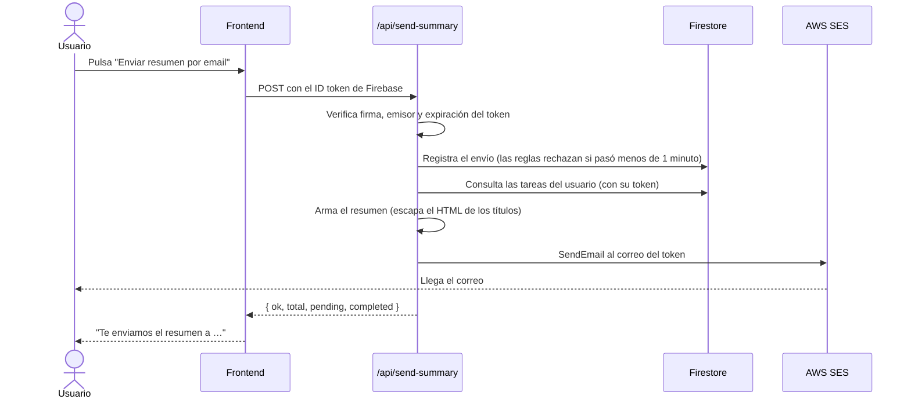

# Task Manager

Aplicación web SPA para gestionar tareas personales. Cada usuario se registra, inicia sesión y administra **sus propias tareas**, almacenadas en la nube y sincronizadas en tiempo real. Con un botón puede recibir por correo un **resumen del estado de todas sus tareas**, enviado con **AWS SES** a través de **Vercel Functions**.

| | |
|---|---|
| 🌐 **Producción** | https://matecode-task-manager-steel.vercel.app |
| 📦 **Repositorio** | https://github.com/MartinaFerreyra/matecode-task-manager |

## Índice

1. [Cómo probar la aplicación (evaluación)](#cómo-probar-la-aplicación-evaluación)
2. [Cumplimiento de la consigna](#cumplimiento-de-la-consigna)
3. [Funcionalidades](#funcionalidades)
4. [Stack tecnológico](#stack-tecnológico)
5. [Arquitectura y decisiones](#arquitectura-y-decisiones)
6. [Instalación](#instalación)
7. [Variables de entorno](#variables-de-entorno)
8. [Configuración de los servicios](#configuración-de-los-servicios)
9. [Flujo de envío de emails](#flujo-de-envío-de-emails)
10. [Seguridad](#seguridad)
11. [Tests](#tests)
12. [Uso de inteligencia artificial en el proceso de desarrollo](#uso-de-inteligencia-artificial-en-el-proceso-de-desarrollo)

---

## Cómo probar la aplicación (evaluación)

Se creó una **cuenta de Google de demostración** exclusiva para la evaluación, sin datos personales. La aplicación admite el ingreso con Google, y es el método previsto para esta prueba.

| Campo | Valor |
|---|---|
| URL | https://matecode-task-manager-steel.vercel.app |
| Cuenta de Google | `pruebaprofesor753@gmail.com` |
| Contraseña de la cuenta | `pruebaprofesor1234` |

**Pasos sugeridos**

1. Abrir la URL de producción y pulsar **Iniciar sesión con Google**. En la ventana de Google elegir *Usar otra cuenta* e ingresar el correo y la contraseña de la tabla (se recomienda una ventana de incógnito).
2. En **Mis tareas**, crear una tarea (título y descripción), editarla, marcarla como completada y eliminarla. Probar los filtros *Todas / Pendientes / Completadas*.
3. Pulsar **Enviar resumen por email**. Debe aparecer *"Te enviamos el resumen a pruebaprofesor753@gmail.com."*
4. Cerrar sesión desde el menú de usuario y comprobar que `/tasks` redirige a `/login` (ruta protegida).
5. Opcional: registrar una cuenta nueva desde `/register`.

> **Sobre el correo de la prueba.** La cuenta de AWS SES está en **modo sandbox**: solo puede enviar a direcciones verificadas en SES. Por eso el resumen se envía a la bandeja de la cuenta de demostración, cuyo correo está verificado. La confirmación se muestra en pantalla. Con una cuenta no verificada, el botón devuelve un error controlado. Al solicitar a AWS el acceso a producción, cualquier usuario podría recibir su resumen sin cambios en el código. Ver [limitaciones conocidas](#limitaciones-conocidas).
>
> El envío está limitado a **un resumen por minuto por usuario**. Si aparece *"Ya enviaste un resumen hace poco"*, esperar un minuto.

---

## Cumplimiento de la consigna

| Requisito | Cumplimiento | Dónde verlo |
|---|---|---|
| **Autenticación**: registro con email y Google, login, logout | ✅ | `src/pages/Login.tsx`, `Register.tsx`, `src/services/authService.ts` |
| Protección de rutas privadas | ✅ | `src/routes/ProtectedRoute.tsx`, `PublicRoute.tsx` |
| Manejo claro de errores de autenticación | ✅ | `src/features/auth/authErrors.ts` (mensajes traducidos, sin texto crudo de Firebase) |
| **Tareas**: crear, listar, editar, eliminar, completar | ✅ | `src/pages/Tasks.tsx`, `src/components/`, `src/hooks/useTasks.ts` |
| Persistencia en Firestore, filtrada por `userId` | ✅ | `src/services/tasksService.ts`, `firestore.rules` |
| Cada usuario solo ve sus tareas | ✅ | Filtro por `userId` **y** reglas de seguridad de Firestore |
| Estados de carga y error, UI actualizada tras cada operación | ✅ | `onSnapshot` en tiempo real, `TodoList` |
| **Email**: botón con resumen de tareas | ✅ | `src/pages/Tasks.tsx`, `src/hooks/useSendSummary.ts` |
| Envío mediante **AWS SES** | ✅ | `api/_lib/ses.ts` |
| SES invocado por **Vercel Functions** | ✅ | `api/send-summary.ts` |
| Sin secretos en el frontend | ✅ | [Verificación de seguridad](#seguridad) |
| **TypeScript** | ✅ | Todo `src/`, `api/` y `tests/` en TypeScript estricto |
| **Testing**: unitarios, componentes y mocks | ✅ | 131 tests en `tests/` |
| **Deploy en Vercel**, URL pública funcional | ✅ | [Producción](https://matecode-task-manager-steel.vercel.app) |
| `.env`, `.env.example` sin datos, `.env` en `.gitignore` | ✅ | Ver [Seguridad](#seguridad) |
| Credenciales de AWS y Firebase como variables de entorno | ✅ | [Variables de entorno](#variables-de-entorno) |
| Código por capas | ✅ | [Estructura del proyecto](#estructura-del-proyecto) |
| Commits semánticos | ✅ | `git log --oneline` (`feat`, `fix`, `refactor`, `test`, `chore`, `docs`) |
| README completo, con el uso de IA | ✅ | Este documento |

---

## Funcionalidades

- **Autenticación**: registro y login con correo y contraseña, o con Google. Cierre de sesión, recuperación de contraseña y mensajes de error claros.
- **Rutas protegidas**: no se pueden ver las tareas sin haber iniciado sesión. Quien ya tiene sesión es redirigido fuera de `/login` y `/register`.
- **Tareas por usuario**: crear (título y descripción), listar, editar, eliminar y marcar como completada. Filtros por todas, pendientes y completadas, con contador.
- **Sincronización en tiempo real**: la interfaz se actualiza sola tras cada operación gracias a `onSnapshot` de Firestore, con estados de carga y de error.
- **Resumen por email**: un botón envía al correo del usuario un resumen con totales y las listas de pendientes y completadas.

## Stack tecnológico

| Capa | Tecnología |
|---|---|
| Frontend | React 19, TypeScript, Vite, React Router |
| Autenticación y datos | Firebase Authentication y Cloud Firestore |
| Backend | Vercel Functions (Node.js, TypeScript) |
| Email | AWS SES (SDK v3) |
| Tests | Vitest, Testing Library, jsdom |
| Calidad | Oxlint, TypeScript en modo estricto |
| Deploy | Vercel |

---

## Arquitectura y decisiones

```
                       ┌────────────────────────── Vercel ──────────────────────────┐
                       │                                                             │
  Navegador (React) ───┼──► Sitio estático (dist/)                                   │
        │              │                                                             │
        │  POST + ID token de Firebase                                               │
        └──────────────┼──► /api/send-summary  (Vercel Function)                     │
        │              │        │  1. verifica el token (jose)                       │
        │              │        │  2. registra el envío (límite 1/min)  ──► Firestore│
        │              │        │  3. lee las tareas del usuario        ──► Firestore│
        │              │        │  4. envía el email                    ──► AWS SES  │
        │              └─────────────────────────────────────────────────────────────┘
        │
        └─► Firebase Auth y Firestore (directo, protegido por reglas de seguridad)
```

### Estructura del proyecto

```
├─ api/                    # Vercel Functions (backend)
│  ├─ send-summary.ts      #   endpoint POST /api/send-summary
│  └─ _lib/                #   auth (token), firestore (REST), ses, summary
├─ src/
│  ├─ pages/               # Vistas: Login, Register, ForgotPassword, Tasks
│  ├─ components/          # UI: TodoForm, TodoList, TodoItem, UserMenu, PasswordInput
│  ├─ features/            # Lógica de dominio pura: auth (errores), tasks (filtros)
│  ├─ services/            # Integraciones: firebase, authService, tasksService, emailService
│  ├─ hooks/               # useAuth, useTasks, useSendSummary
│  ├─ routes/              # AppRoutes, ProtectedRoute, PublicRoute
│  ├─ types/               # Tipos compartidos: Task, AppUser, SendSummaryResult
│  └─ utils/               # Helpers (validación de contraseña)
├─ tests/                  # api, components, hooks, pages, routes, services, unit, mocks
├─ firestore.rules         # Reglas de seguridad de Firestore
├─ vercel.json             # Rewrite para la SPA y configuración de la función
├─ .env.example            # Plantilla de variables de entorno (sin datos)
└─ README.md
```

> La estructura sugerida nombra la carpeta del backend `functions/`. Se usó `api/` porque es la convención de Vercel: todo archivo en `api/` se despliega como función sin configuración adicional. Los archivos de `api/_lib/` (con guion bajo) no se exponen como endpoints.

### Decisiones arquitectónicas

| Decisión | Motivo |
|---|---|
| **Capas con responsabilidades separadas** | Los componentes solo muestran, los hooks manejan estado, los servicios son la única parte que habla con Firebase o con el backend, y `features/` contiene lógica pura y testeable. Los servicios devuelven promesas y no reciben callbacks: quien los llama decide cómo mostrar el error. |
| **Vercel Functions para el email** (no Cloud Functions de Firebase) | Las Cloud Functions exigen el plan de pago de Firebase para llamar a servicios externos como AWS. Vercel Functions tiene plan gratuito, vive en el mismo dominio que el sitio (sin CORS) y coincide con la plataforma de deploy. |
| **El destinatario nunca lo elige el cliente** | El backend toma el correo del token de Firebase ya verificado, así el endpoint no puede usarse para enviar correo a terceros. |
| **El backend actúa con el token del usuario** | Para leer las tareas llama a la API REST de Firestore con el ID token del propio usuario: las reglas de seguridad siguen aplicando y no se guardan credenciales de administrador de Firebase. |
| **Límite de un envío por minuto, aplicado por las reglas de Firestore** | El endpoint escribe `emailRateLimits/{uid}` con la hora del servidor y `firestore.rules` rechaza toda escritura hecha antes de un minuto. El cliente no puede evitarlo porque tampoco puede modificar ni borrar ese documento. |
| **Secretos solo en el servidor** | Las credenciales de AWS son variables de entorno de Vercel sin prefijo `VITE_`, por lo que Vite no las incluye en el JavaScript público. Se usan nombres `SES_*` porque Vercel reserva `AWS_*`. |
| **Privilegio mínimo en AWS** | El usuario IAM solo puede ejecutar `ses:SendEmail`, y únicamente sobre las identidades verificadas. |
| **Seguridad por usuario en dos niveles** | Las consultas filtran por `userId` y, además, `firestore.rules` impide leer o modificar tareas ajenas aunque se manipule el cliente. |
| **TypeScript estricto en todo el proyecto** | Configuraciones separadas para frontend, API y tests, todas verificadas por `npm run build`. |

---

## Instalación

Requisitos: **Node.js 22.12 o superior** (lo exige Vitest; Vite pide 20.19+) y una cuenta de Firebase.

```bash
git clone https://github.com/MartinaFerreyra/matecode-task-manager.git
cd matecode-task-manager
npm install
cp .env.example .env     # y completar los valores (ver la siguiente sección)
npm run dev              # http://localhost:5173
```

Con `npm run dev` funcionan el login, el registro y las tareas. El botón de email llama a `/api/send-summary`, que en desarrollo local solo existe al ejecutar con la CLI de Vercel (`vercel dev`, con `vercel link` y `vercel env pull` previos). Alternativamente, se prueba en el sitio desplegado.

### Scripts

| Comando | Descripción |
|---|---|
| `npm run dev` | Servidor de desarrollo |
| `npm run build` | Verifica los tipos (`tsc -b`) y genera el build de producción |
| `npm run preview` | Sirve el build localmente |
| `npm run lint` | Linter (Oxlint) |
| `npm test` | Ejecuta todos los tests una vez |
| `npm run test:watch` | Tests en modo interactivo |

---

## Variables de entorno

Copiar `.env.example` a `.env` (**este archivo no se sube al repositorio**). En producción se cargan en Vercel → *Settings → Environment Variables*, en *All Environments*. Tras cambiar variables hay que hacer un **Redeploy**.

### Frontend (públicas)
Vite las incluye en el bundle. Son la configuración web de Firebase, pública por diseño.

| Variable | Descripción |
|---|---|
| `VITE_FIREBASE_API_KEY` | API key de la app web de Firebase |
| `VITE_FIREBASE_AUTH_DOMAIN` | Dominio de autenticación |
| `VITE_FIREBASE_PROJECT_ID` | ID del proyecto |
| `VITE_FIREBASE_STORAGE_BUCKET` | Bucket de almacenamiento |
| `VITE_FIREBASE_MESSAGING_SENDER_ID` | ID de remitente de mensajería |
| `VITE_FIREBASE_APP_ID` | ID de la app |

### Backend (secretas, solo Vercel Functions)
**No deben llevar el prefijo `VITE_`**, o quedarían expuestas en el navegador.

| Variable | Descripción |
|---|---|
| `FIREBASE_PROJECT_ID` | ID del proyecto de Firebase, para validar el token del usuario |
| `SES_REGION` | Región de AWS SES (por ejemplo `us-east-1`) |
| `SES_FROM_EMAIL` | Remitente, verificado en SES |
| `SES_ACCESS_KEY_ID` | Access key del usuario IAM |
| `SES_SECRET_ACCESS_KEY` | Secret key del usuario IAM (marcar *Sensitive* en Vercel) |

---

## Configuración de los servicios

### Firebase
1. Crear un proyecto y registrar una **app web** para obtener las variables `VITE_FIREBASE_*`.
2. En *Authentication → Sign-in method*, habilitar **Email/contraseña** y **Google**.
3. En *Authentication → Settings → Authorized domains*, agregar el dominio de producción (`matecode-task-manager-steel.vercel.app`). Sin esto, el login con Google falla.
4. Crear la base de **Cloud Firestore** y desplegar las reglas:
   ```bash
   firebase deploy --only firestore:rules
   ```

### AWS SES
1. Verificar en SES una **identidad** (el correo remitente).
2. Crear un usuario IAM sin acceso a la consola, con esta política mínima (reemplazar región, cuenta e identidad):
   ```json
   {
     "Version": "2012-10-17",
     "Statement": [{
       "Effect": "Allow",
       "Action": "ses:SendEmail",
       "Resource": "arn:aws:ses:<REGION>:<ACCOUNT_ID>:identity/<REMITENTE>"
     }]
   }
   ```
3. Generar una access key para ese usuario y cargarla en Vercel como `SES_ACCESS_KEY_ID` y `SES_SECRET_ACCESS_KEY`.

### Vercel
1. Importar el repositorio (el preset de Vite se detecta solo).
2. Cargar las 11 variables de entorno en *All Environments*.
3. Desplegar.

---

## Flujo de envío de emails



Respuestas del endpoint:

| Código | Significado |
|---|---|
| `200` | Email enviado |
| `401` | Falta el token o no es válido |
| `405` | Método distinto de POST |
| `429` | Ya se envió un resumen hace menos de un minuto |
| `500` | Error de configuración o de SES. El detalle queda solo en los logs del servidor y nunca se devuelve al cliente |

### Limitaciones conocidas
- Mientras la cuenta de SES esté en **modo sandbox**, solo se puede enviar a direcciones verificadas. Para enviar a cualquier usuario hay que solicitar a AWS el acceso a producción (no requiere cambios en el código).
- El resumen incluye hasta 500 tareas.
- Un envío fallido también cuenta para el límite de un minuto.

---

## Seguridad

- **`.env`** existe solo en local y está en `.gitignore`. Se versiona únicamente `.env.example`, sin valores.
- **Credenciales de Firebase y de AWS** se leen de variables de entorno (`import.meta.env` en el frontend y `process.env` en las funciones). No hay claves escritas en el código.
- **Ningún commit** contiene variables de entorno.
- **Las claves de AWS nunca llegan al navegador**: el frontend solo llama a `/api/send-summary` con el token de sesión del usuario.

### Cómo verificarlo

```bash
# 1. Solo debe figurar .env.example
git ls-files | grep .env

# 2. No debe haber claves de AWS en todo el historial (resultado: 0)
git log --all -p | grep -cE "AKIA[0-9A-Z]{16}"

# 3. El JavaScript publicado no debe contenerlas (resultado: 0)
curl -s https://matecode-task-manager-steel.vercel.app/ | grep -oE 'assets/index-[^"]+\.js'
curl -s https://matecode-task-manager-steel.vercel.app/assets/<archivo>.js | grep -cE "AKIA|SES_SECRET|SES_ACCESS|amazonaws"

# 4. El endpoint rechaza las peticiones sin sesión (401)
curl -i -X POST https://matecode-task-manager-steel.vercel.app/api/send-summary
```

En el navegador también puede comprobarse con `F12 → Network`: la petición `send-summary` solo lleva `Authorization: Bearer <token de Firebase>`.

Las variables `VITE_FIREBASE_*` **sí** son visibles en el frontend, y es lo esperado: es la configuración web de Firebase, pública por diseño. La seguridad de los datos la aportan las reglas de Firestore y los dominios autorizados, no ocultar esos valores.

---

## Tests

131 tests en 21 archivos, con Firebase, AWS y `fetch` mockeados para que no dependan de la red ni de credenciales.

| Área | Qué se prueba |
|---|---|
| **Backend** (`tests/api`) | Armado del resumen y escapado de HTML, lectura de Firestore y el endpoint completo: 401, 405, 429, éxito y error de SES sin filtrar detalles |
| **Componentes** (`tests/components`) | `TodoForm`, `TodoList`, `TodoItem`, `PasswordInput` |
| **Páginas** (`tests/pages`) | Login, Register, recuperación de contraseña y Tasks (filtros, modal, estados del botón de email) |
| **Rutas** (`tests/routes`) | `ProtectedRoute` no muestra nada sin sesión; `PublicRoute` redirige a quien ya la tiene |
| **Hooks** (`tests/hooks`) | `useAuth`, `useTasks` (incluido el cambio de usuario) y `useSendSummary` |
| **Servicios y lógica pura** (`tests/services`, `tests/unit`) | Auth, tareas, email, errores de autenticación, filtros y validaciones |

```bash
npm test
```

---

## Uso de inteligencia artificial en el proceso de desarrollo

### Herramienta y rol
Utilicé **Claude Code**, un asistente de IA que opera desde la terminal con acceso al repositorio, como apoyo a lo largo de todo el ciclo: planificación, implementación, pruebas, depuración del despliegue y documentación. Las decisiones de producto y de arquitectura (qué plataforma usar, qué alcance tiene cada entrega, qué se publica) las tomé yo. La IA propuso alternativas, ejecutó el trabajo bajo mi revisión y verificó sus resultados.

### Flujo de trabajo
1. **Definir el objetivo y las restricciones** antes de pedir código (por ejemplo, no poder pagar el plan Blaze de Firebase, y que la consigna exigiera Vercel).
2. **Pedir un plan por etapas** y aprobar las decisiones importantes antes de implementar.
3. **Implementar de forma incremental**, verificando en cada etapa con tests, chequeo de tipos, linter y build.
4. **Revisar los cambios** y guardarlos en commits semánticos, uno por bloque de trabajo.
5. **Verificar en producción** con pruebas reproducibles, no solo en local.

### En qué situaciones fue más efectiva
- **Auditoría contra la consigna.** Al contrastar el proyecto con el enunciado, la IA detectó que la primera versión del envío (AWS Lambda) no cumplía con "SES invocado a través de Vercel Functions". Se corrigió a tiempo, reutilizando casi todo el código.
- **Refactor amplio y mecánico.** Migrar de JavaScript a TypeScript y separar el código en capas (`types`, `features`, `services`, `hooks`) con tipos consistentes fue mucho más rápido con asistencia.
- **Testing.** Generó 131 tests con mocks de Firebase, Firestore, SES y `fetch`, incluyendo casos borde: título vacío, límite de envíos, error de SES sin filtrar detalles al cliente, cambio de usuario en `useTasks`.
- **Diagnóstico del despliegue.** A partir del mensaje exacto de cada error, identificó la causa: `auth/invalid-api-key` por variables `VITE_` mal cargadas en el build; el dominio de Vercel sin autorizar en Firebase; variables asignadas solo a *Preview* en lugar de *Production*; y un permiso de IAM con un ARN de ejemplo en lugar del real. En varios casos lo comprobó consultando el sitio real desde fuera (el endpoint pasó de `500` a `401`).
- **Revisión de seguridad.** Escaneó el JavaScript publicado y todo el historial de git en busca de claves de AWS.

### Ejemplo de una interacción representativa: auditoría contra la consigna

**Contexto.** Con la primera versión del envío de email ya funcionando en local, quise comprobar que el proyecto cumplía el enunciado y el entregable antes de seguir invirtiendo tiempo.

**Consulta** (en la sesión fue una versión más breve; esta es la formulación que recomiendo, con criterios explícitos):

> Te comparto el enunciado completo y los criterios del entregable. Audita el estado real del repositorio contra cada requisito (autenticación, CRUD, Firestore, email con SES, TypeScript, tests, deploy, seguridad, estructura, commits y README) y dime, con evidencia del código, cuáles cumplimos, cuáles cumplimos parcialmente y cuáles no. Ordena lo pendiente por prioridad y señala las decisiones que me corresponden a mí. **No modifiques nada todavía:** primero quiero revisar el diagnóstico.

**Respuesta de la IA (resumen).** Inspeccionó el repositorio real (remoto de git, historial, extensiones de archivos, carpeta de tests, configuración de Vercel) y devolvió una tabla por requisito, sin hacer cambios. Hallazgos principales:

| Hallazgo | Detalle |
|---|---|
| **Desalineación crítica** | El envío de email estaba construido sobre AWS Lambda, pero la consigna exige *SES invocado a través de Vercel Functions*. Propuso migrarlo reutilizando casi todo el código. |
| TypeScript | 14 archivos JS/JSX contra 2 en TypeScript, y `npm run build` no pasaba. |
| Tests | La carpeta `tests/` estaba vacía. |
| Control de versiones | Un solo commit, con todo el trabajo sin versionar. |
| Seguridad y errores | Las reglas de Firestore no estaban desplegadas y el login con Google no mostraba errores al usuario. |
| Documentación | El README era el de la plantilla de Vite. |

Cerró con un orden de trabajo (email, TypeScript y estructura, tests, deploy, README y commits) y cuatro decisiones que me correspondían: confirmar el cambio de Lambda a Vercel, elegir la carpeta `api/` o `functions/`, separar Login y Register, y validar el orden propuesto.

**Resultado.** Aprobé el plan y se ejecutó completo: el email se migró a Vercel Functions, todo `src/` pasó a TypeScript, se escribieron 131 tests y el proyecto se desplegó. Detectar la desalineación en esta etapa evitó descubrirla al momento de entregar, cuando rehacerlo habría sido mucho más costoso.

**Por qué funcionó.** Compartir el enunciado completo dio criterios verificables; pedir el diagnóstico *sin cambios* mantuvo el control en mis manos; exigir evidencia del código evitó una respuesta genérica; y la IA devolvió como decisiones mías lo que realmente lo eran.

### Ejemplo breve: diagnóstico de un error de despliegue

**Consulta.** Pegué el mensaje exacto de la consola (`auth/invalid-api-key`, luego "El servicio no está configurado", luego un `AccessDeniedException` de AWS) junto con lo que veía en el panel de Vercel.

**Respuesta.** En cada caso la IA identificó la causa concreta y los pasos para corregirla: variables `VITE_` ausentes en el build, `FIREBASE_PROJECT_ID` asignada solo al entorno *Preview* en lugar de *Production*, y una política de IAM que aún tenía el ARN de ejemplo. Además **lo verificó desde fuera** consultando el endpoint real: pasó de `500 - El servicio no está configurado` a `401 - Tenés que iniciar sesión…` cuando la variable quedó bien. Ese patrón (reportar el mensaje exacto, recibir la causa y confirmar con una prueba objetiva) resolvió cada bloqueo en pocos intentos.

### Patrones y buenas prácticas que descubrí
- **Dar contexto y restricciones explícitas desde el principio.** Una sola restricción (no pagar Blaze) cambió toda la arquitectura del envío.
- **Plan antes que código**, pidiendo que se expongan los *trade-offs* de cada alternativa (Cloud Functions, Lambda, Vercel Functions).
- **Verificar con evidencia en lugar de aceptar afirmaciones.** Las comprobaciones concretas (tests, `curl`, escaneo del bundle) valen más que una respuesta que "suena bien".
- **Higiene de secretos.** Los valores de las claves nunca pasaron por la conversación con la IA: se cargaron directamente en Vercel.
- **Mínimo privilegio** en IAM y separación estricta entre variables públicas (`VITE_`) y privadas.
- **Cambios pequeños y commits atómicos**, con el trabajo respaldado en git antes de refactors grandes. La herramienta bloqueó, con razón, borrar archivos que aún no estaban versionados.
- **Los tests como documentación** del comportamiento esperado y como red de seguridad ante cada cambio.

### Limitaciones y controles aplicados
- **Propuestas que hubo que corregir.** La primera solución para el email (Cloud Functions) requería un plan de pago; se descartó por no cumplir las restricciones.
- **Valores de ejemplo en plantillas.** Un ARN de ejemplo en una política de IAM tuvo que reemplazarse por el real.
- **Errores en las pruebas.** Un test falló por la validación nativa de `input type="email"` del navegador; se corrigió el test, no el código.
- **Sin acceso a las consolas.** La IA no puede ver AWS, Vercel ni Firebase; la configuración manual dependió de que yo describiera lo que veía en cada paso.
- **"Compila" no es "funciona".** Fue necesario probar en producción para detectar problemas de configuración que ningún test local podía ver.

### Aprendizajes
La IA acelera de forma notable las tareas repetitivas, la depuración y la escritura de pruebas, pero rinde mejor cuando el objetivo y las restricciones están claros, cada resultado se verifica con evidencia y se entiende cada decisión de diseño. La responsabilidad sobre la arquitectura, la seguridad y la calidad del resultado sigue siendo del desarrollador.
