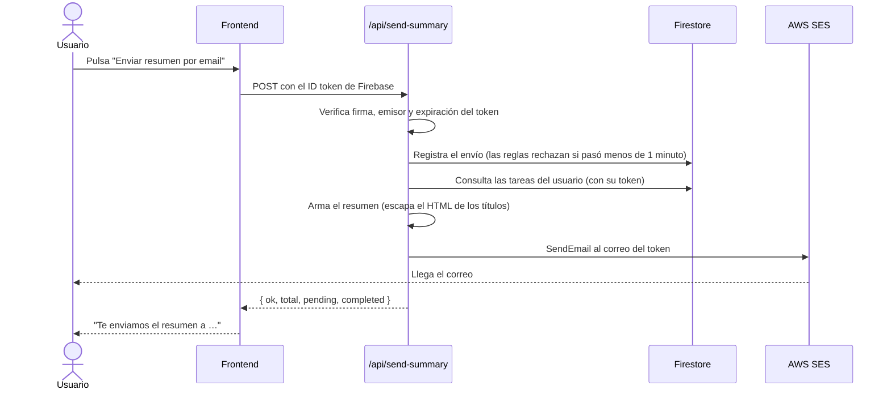

# Task Manager

Aplicación web SPA para gestionar tareas personales. Cada usuario se registra, inicia sesión y administra **sus propias tareas**, guardadas en la nube y sincronizadas en tiempo real. Con un botón puede recibir por email un **resumen del estado de todas sus tareas**, enviado con AWS SES.

**🌐 Producción:** https://matecode-task-manager-steel.vercel.app

## Funcionalidades

- **Autenticación**: registro y login con email y contraseña, o con Google. Logout, recuperación de contraseña y mensajes de error claros.
- **Rutas protegidas**: no se pueden ver las tareas sin haber iniciado sesión. Quien ya tiene sesión es redirigido fuera de `/login` y `/register`.
- **Tareas por usuario**: crear (título y descripción), listar, editar, eliminar y marcar como completada. Filtros por todas, pendientes y completadas, con contador.
- **Sincronización en tiempo real**: la interfaz se actualiza sola después de cada operación gracias a `onSnapshot` de Firestore. Con estados de carga y de error.
- **Resumen por email**: un botón envía al correo del usuario un resumen con totales y listas de pendientes y completadas.

## Stack

| Capa | Tecnología |
|---|---|
| Frontend | React 19, TypeScript, Vite, React Router |
| Autenticación y datos | Firebase Auth y Cloud Firestore |
| Backend | Vercel Functions (Node.js, TypeScript) |
| Email | AWS SES (SDK v3) |
| Tests | Vitest, Testing Library, jsdom |
| Calidad | Oxlint, TypeScript en modo estricto |
| Deploy | Vercel |

## Arquitectura

```
                       ┌────────────────────────── Vercel ──────────────────────────┐
                       │                                                             │
  Navegador (React) ───┼──► Sitio estático (dist/)                                   │
        │              │                                                             │
        │  POST + ID token de Firebase                                               │
        └──────────────┼──► /api/send-summary  (Vercel Function)                     │
        │              │        │  1. verifica el token (jose)                       │
        │              │        │  2. registra el envío (límite 1/min)  ──► Firestore│
        │              │        │  3. lee las tareas del usuario        ──► Firestore│
        │              │        │  4. envía el email                    ──► AWS SES  │
        │              └─────────────────────────────────────────────────────────────┘
        │
        └─► Firebase Auth y Firestore (directo, protegido por reglas de seguridad)
```

### Estructura del proyecto

```
├─ api/                    # Vercel Functions (backend)
│  ├─ send-summary.ts      #   endpoint POST /api/send-summary
│  └─ _lib/                #   auth (token), firestore (REST), ses, summary
├─ src/
│  ├─ pages/               # Vistas: Login, Register, ForgotPassword, Tasks
│  ├─ components/          # UI: TodoForm, TodoList, TodoItem, UserMenu, PasswordInput
│  ├─ features/            # Lógica de dominio pura: auth (errores), tasks (filtros)
│  ├─ services/            # Integraciones: firebase, authService, tasksService, emailService
│  ├─ hooks/               # useAuth, useTasks, useSendSummary
│  ├─ routes/              # AppRoutes, ProtectedRoute, PublicRoute
│  ├─ types/               # Tipos compartidos: Task, AppUser, SendSummaryResult
│  └─ utils/               # Helpers (validación de contraseña)
├─ tests/                  # api, components, hooks, pages, routes, services, unit, mocks
├─ firestore.rules         # Reglas de seguridad de Firestore
├─ vercel.json             # Rewrite para la SPA y configuración de la función
├─ .env.example            # Plantilla de variables de entorno (sin secretos)
└─ README.md
```

> La estructura sugerida nombra la carpeta del backend `functions/`. Se usó `api/` porque es la convención de Vercel: cualquier archivo en `api/` se despliega como función sin configuración extra. Los archivos de `api/_lib/` (con guion bajo) no se exponen como endpoints.

### Decisiones arquitectónicas

**Capas con responsabilidades separadas.** Los componentes solo muestran; los hooks manejan estado; los servicios son la única parte que habla con Firebase o con el backend; `features/` contiene lógica pura y testeable. Los servicios devuelven promesas y no reciben callbacks, y quien los llama decide cómo mostrar el error.

**Vercel Functions para el email, no Cloud Functions de Firebase.** Las Cloud Functions requieren el plan de pago de Firebase (Blaze) para llamar a servicios externos como AWS. Vercel Functions ofrece un plan gratuito, vive en el mismo dominio que el sitio (no hace falta CORS) y encaja con el deploy en Vercel.

**El destinatario nunca lo elige el cliente.** El backend toma el email del token de Firebase ya verificado. Así el endpoint no se puede usar para mandar correo a terceros.

**El backend actúa con el token del usuario, no con una cuenta de servicio.** Para leer las tareas, `/api/send-summary` llama a la API REST de Firestore con el ID token del propio usuario. Las reglas de seguridad se siguen aplicando y no hace falta guardar credenciales de administrador de Firebase.

**Límite de un envío por minuto, aplicado por las reglas de Firestore.** El endpoint escribe `emailRateLimits/{uid}` con la hora del servidor, y `firestore.rules` rechaza toda escritura hecha antes de que pase un minuto. El cliente no puede evitarlo, porque tampoco puede borrar ni modificar ese documento.

**Secretos solo en el servidor.** Las credenciales de AWS están en variables de entorno de Vercel sin prefijo `VITE_`, así que Vite no las incluye en el JavaScript público. Se usan los nombres `SES_*` porque Vercel reserva `AWS_*`. Se verificó el bundle publicado y no contiene ninguna clave.

**Privilegio mínimo en AWS.** El usuario IAM solo tiene el permiso `ses:SendEmail` sobre la identidad verificada.

**Seguridad por usuario en dos niveles.** Las consultas filtran por `userId` y, además, `firestore.rules` impide que un usuario lea o modifique tareas ajenas aunque manipule el cliente.

**TypeScript estricto en todo el proyecto**, con configuraciones separadas para el frontend, la API y los tests, y `npm run build` verificando los tres.

## Instalación

Requisitos: **Node.js 22.12 o superior** (lo exige Vitest; Vite pide 20.19+) y una cuenta de Firebase.

```bash
git clone https://github.com/MartinaFerreyra/matecode-task-manager.git
cd matecode-task-manager
npm install
cp .env.example .env     # y completa los valores (ver la siguiente sección)
npm run dev              # http://localhost:5173
```

Con `npm run dev` funcionan el login, el registro y las tareas. El botón de email llama a `/api/send-summary`, que en desarrollo local solo existe si se ejecuta con la CLI de Vercel (`vercel dev`, con `vercel link` y `vercel env pull` previos). Alternativamente, se prueba en el sitio desplegado.

### Scripts

| Comando | Descripción |
|---|---|
| `npm run dev` | Servidor de desarrollo |
| `npm run build` | Verifica los tipos (`tsc -b`) y genera el build de producción |
| `npm run preview` | Sirve el build localmente |
| `npm run lint` | Linter (Oxlint) |
| `npm test` | Ejecuta todos los tests una vez |
| `npm run test:watch` | Tests en modo interactivo |

## Variables de entorno

Copia `.env.example` a `.env` (**este archivo no se sube al repositorio**) y, en producción, cárgalas en Vercel → Settings → Environment Variables, en *All Environments*.

### Frontend (públicas)
Vite las incluye en el bundle. Es configuración web de Firebase, pública por diseño: no se puede considerar secreta.

| Variable | Descripción |
|---|---|
| `VITE_FIREBASE_API_KEY` | API key de la app web de Firebase |
| `VITE_FIREBASE_AUTH_DOMAIN` | Dominio de autenticación |
| `VITE_FIREBASE_PROJECT_ID` | ID del proyecto |
| `VITE_FIREBASE_STORAGE_BUCKET` | Bucket de almacenamiento |
| `VITE_FIREBASE_MESSAGING_SENDER_ID` | ID de remitente de mensajería |
| `VITE_FIREBASE_APP_ID` | ID de la app |

### Backend (secretas, solo Vercel Functions)
**No deben llevar el prefijo `VITE_`**, o quedarían expuestas en el navegador.

| Variable | Descripción |
|---|---|
| `FIREBASE_PROJECT_ID` | ID del proyecto de Firebase, para validar el token del usuario |
| `SES_REGION` | Región de AWS SES (por ejemplo `us-east-1`) |
| `SES_FROM_EMAIL` | Remitente, verificado en SES |
| `SES_ACCESS_KEY_ID` | Access key del usuario IAM |
| `SES_SECRET_ACCESS_KEY` | Secret key del usuario IAM (marcar *Sensitive* en Vercel) |

## Configuración de los servicios

### Firebase
1. Crea un proyecto y registra una **app web** para obtener las variables `VITE_FIREBASE_*`.
2. En *Authentication → Sign-in method*, habilita **Email/contraseña** y **Google**.
3. En *Authentication → Settings → Authorized domains*, agrega el dominio de producción (`matecode-task-manager-steel.vercel.app`). Sin esto, el login con Google falla.
4. Crea la base de **Cloud Firestore** y despliega las reglas:
   ```bash
   firebase deploy --only firestore:rules
   ```

### AWS SES
1. Verifica en SES una **identidad** (el email remitente).
2. Crea un usuario IAM sin acceso a la consola, con esta política mínima (reemplaza región, cuenta e identidad):
   ```json
   {
     "Version": "2012-10-17",
     "Statement": [{
       "Effect": "Allow",
       "Action": "ses:SendEmail",
       "Resource": "arn:aws:ses:<REGION>:<ACCOUNT_ID>:identity/<REMITENTE>"
     }]
   }
   ```
3. Genera una access key para ese usuario y cárgala en Vercel como `SES_ACCESS_KEY_ID` y `SES_SECRET_ACCESS_KEY`.

### Vercel
1. Importa el repositorio en Vercel (el preset de Vite se detecta solo).
2. Carga las 11 variables de entorno en *All Environments*.
3. Despliega. Cada cambio de variables requiere un **Redeploy**.

## Flujo de envío de emails



Códigos de respuesta del endpoint:

| Código | Significado |
|---|---|
| `200` | Email enviado |
| `401` | Falta el token o no es válido |
| `405` | Método distinto de POST |
| `429` | Ya se envió un resumen hace menos de un minuto |
| `500` | Error de configuración o de SES (el detalle queda solo en los logs del servidor, nunca se devuelve al cliente) |

### Limitaciones conocidas
- Mientras la cuenta de SES esté en **modo sandbox**, solo se puede enviar a direcciones verificadas en SES. Para enviar a cualquier usuario hay que solicitar el acceso a producción a AWS.
- El resumen incluye hasta 500 tareas.
- Un envío fallido también cuenta para el límite de un minuto.

## Tests

Más de 130 tests en `tests/`, con Firebase, AWS y `fetch` mockeados para que no dependan de la red ni de credenciales:

- **Backend** (`tests/api`): armado del resumen, escapado de HTML, lectura de Firestore, y el endpoint completo (401, 405, 429, éxito, error de SES sin filtrar detalles).
- **Componentes y páginas**: formularios, ítems y lista de tareas, Login, Register, recuperación de contraseña y la pantalla de tareas (filtros, modal, estados del botón de email).
- **Rutas**: que la ruta protegida no muestre nada sin sesión.
- **Hooks**: `useAuth`, `useTasks` (incluido el cambio de usuario) y `useSendSummary`.
- **Servicios y lógica pura**: auth, tareas, email, errores de autenticación, filtros y validaciones.

```bash
npm test
```

## Cómo integré la IA en mi proceso de trabajo

<!-- BORRADOR generado a partir de lo ocurrido durante el desarrollo. Revisalo y reescribilo con tus propias palabras y tu experiencia antes de entregar. -->

Usé **Claude Code** (un asistente de IA en la terminal con acceso al proyecto) como compañero de programación durante todo el trabajo.

**Dónde fue más efectivo**
- **Planificar antes de escribir código.** Pedir primero un plan por pasos y decidir yo las opciones (Cloud Functions, Lambda o Vercel Functions) evitó rehacer más trabajo.
- **Trabajo repetitivo y de estructura**: migrar de JavaScript a TypeScript, separar el código por capas y escribir más de 130 tests con mocks.
- **Diagnosticar errores de despliegue** a partir del mensaje exacto: `auth/invalid-api-key`, dominio no autorizado en Firebase, variables de entorno asignadas al entorno equivocado, o un permiso de IAM con un ARN de ejemplo. En varios casos la IA probó el sitio real desde fuera para confirmar la causa.
- **Revisar el proyecto contra la consigna.** Una auditoría contra el enunciado detectó que el envío de email estaba en la plataforma equivocada (AWS Lambda en lugar de Vercel Functions) y permitió corregirlo a tiempo.

**Patrones y buenas prácticas que descubrí**
- **Dar contexto y restricciones claras**: no poder pagar el plan de Firebase cambió la arquitectura entera, y conviene decirlo desde el principio.
- **Pedir el plan antes del código y aprobar cada decisión importante.**
- **Verificar, no confiar.** Comprobar las afirmaciones con evidencia: que el JavaScript publicado no contiene claves, que el endpoint responde `401` sin token, que los tests y el build pasan.
- **Los secretos nunca pasan por la conversación con la IA.** Se cargan directamente en Vercel.
- **Commits por bloque de trabajo** con mensajes semánticos, para poder deshacer o revisar cada cambio.
- **Guardar el trabajo en git antes de pedir cambios grandes**: en un momento, la herramienta bloqueó con razón borrar archivos que todavía no estaban commiteados.

**Errores y límites de la IA que tuve que corregir**
- Propuso primero una solución (Cloud Functions) que requería un plan de pago y no cumplía con la consigna de usar Vercel.
- Dejó valores de ejemplo en una plantilla (un ARN falso) que había que reemplazar por los reales.
- Algunos tests fallaron por detalles del entorno y hubo que ajustarlos.
- **No puede ver mi consola de AWS, Vercel o Firebase**: en cada paso de configuración dependí de describirle lo que veía.

**Conclusión:** la IA acelera mucho, pero funciona mejor cuando yo defino el objetivo y las restricciones, reviso lo que hace, verifico los resultados y entiendo cada decisión, porque la responsabilidad del sistema sigue siendo mía.
